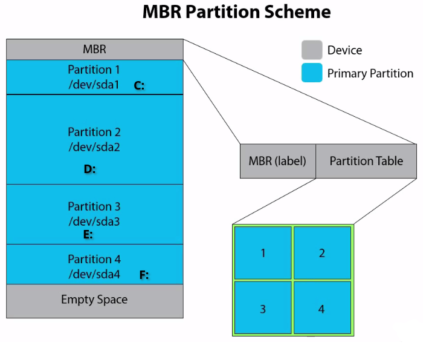
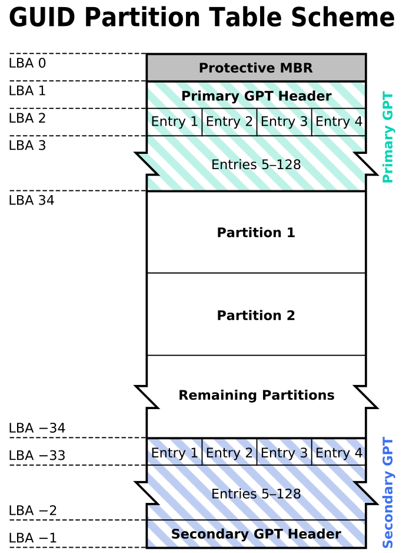

## Me

- David Cruciani - david.cruciani@circl.lu

- M2 SSI - Univ Lorraine - 2021
- CIRCL since 2021

- Forensic Analyst
- Developer

## Overview

- 1. Introduction - (*Course 1*)
- 2. Understand disk - (*Course 1*)
- 3. Imaging / Cloning and Mounting - (*Course 1*)
- 4. File system analysis - (*Course 2*)
- 5. NTFS - (*Course 2*)
- 6. File System Time Line - (*Course 2*)
- 7. Carving and String Search - (*Course 2*)
- 8. Windows Registry - (*Course 2*)
- 9. Windows Event Logs - (*Course 2*)
- 10. Other Windows Artifacts - (*Course 2*)
- 11. Introduction to Flowintel - (*Course 3*)
- 12. The Exercise - (*Course 3*)

# 1. Introduction
## 1.1 Incident reponse
- Someone call for an incident
- Compromised server
- Strange connection from PC of John
- Multiple disks are collected

## 1.1 Incident reponse - Finding answers

- Is there an incident
- System involved at all
- If yes, how and when
- System compromised
- Malware/RAT involved  
- Persistence mechanisms  
- Root cause of the compromise  
- Lateral movement inside LAN  
- Access sensitive data  
- Data exfiltration  
- Illegal content

## 1.1 Incident reponse - Basic problem: Admin
- Get operational asap
  - Re-install
  - Re-image
  - Restore from backup

    &rarr; Destroy of evidences

<br/>

- Analyse the system on his own:
  - Do some investigations
  - Install and run (several) Anti virus
  - Apply updates for OS and Apps

    &rarr; Create big noise

    &rarr; Overwrite evidences

&rarr; Negative impact on forensics


## 1.2 Preservation of evidences
- Legal case:

  &rarr; Collect & safe evidences

  &rarr; Witness testimony for court

- Use cryptographic hash function

  &rarr; Ensure integrity of the evidences

- Make copy of evidences

- Write blocker

## 1.3 Order of Volatility (OOV)
- CPU registers &rarr; nanoseconds
- CPU cache &rarr; nanoseconds
- RAM memory &rarr; tens of nanoseconds
- Network state &rarr; milliseconds
- Processes running &rarr; seconds
- Disk, system settings, data &rarr; minutes
- External disks, backup &rarr; years
- Optical storage, printouts &rarr; tens of ears


## 1.4 Forensic Science
- Write down everything you see, hear, smell and do

- Scope of the analysis

- Chain of custody
  - A process that tracks the movement of evidence through its collection, safeguarding, and analysis lifecycle by documenting each person who handled the evidence, the date/time it was collected or transferred, and the purpose for any transfers.

  &rarr; https://www.nist.gov/document/sample-chain-custody-formdocx

## 1.5 Forensic Disciplines
- Post-mortem Analysis
- Memory Forensics
- Reverse Engineering
- Code-Deobfuscation
- Network Forensics
- Mobile Forensics
- Cloud Forensics

## 1.6 First Responder: Be prepared
- Prepare your toolbox
  - Write Blocker
  - Photo camera
  - Flash light, magnifying glasses
  - Labelling device, labels, tags, stickers
  - Toolkit, screwdriver kits
  - Packing boxes, bags, faraday bag
  - Cable kits, storage devices
  - Anti-static band, network cables
  - Pens, markers, notepads
    
    &rarr; Chain of custody
  - Mouse jiggler

- Talk with people; Take notes
- Identify potential evidences (Computer, devices, paper, ...)

## 1.6 First Responder: First steps
- Powered-on versus powered-off
  - Shutdown: Lost of live (memory) data
  - Pull power: Corrupt file system
  - Live analysis: Modify memory and disk
  - Live analysis: Working with compromised binaries?

- USB stick
  - 256 GB USB3
  - File system: exFAT
  - Memory dump: Comae-Toolkit
  - Memory and Live Acquisition: FTK Imager Lite
  - Encrypted Disk Detector - Edd
  - Security Scanner: Nmap command line
  - Sysinternals Suite

## 1.6 First Responder: Live Response

- In case of a live analysis:\
  &rarr; System time\
  &rarr; Logged-on users\
  &rarr; Open files\
  &rarr; Network - connections - status\
  &rarr; Process information - memory\
  &rarr; Process / port mapping\
  &rarr; Clipboard content\
  &rarr; Services\
  &rarr; Command history\
  &rarr; Mapped drives / shares\
  &rarr; !!! Do not store information on the subject system !!!\

## 1.6 First Responder: Live Response
- Isolate system from (WiFi) network
- Perform memory dump
- Shutdown and do disk image (If possible)
- Logical image of live system (Possible issues)

## 1.7 Post-mortem Analysis
- Hardware layer & acquisition
  - Best copy (in the safe)
  - Working copy (on a NAS)
  - Working copy attached with Write Blocker
  - Disk volumes and partitions
  - Simple tools: dmesg, dd, mount
- Sector layer
  - Carving: foremost, scalpel, testdisk/photorec
  - String search
- File system layer
  - FAT, NTFS
  - File system timeline
  - Restore deleted files

## 1.7 Post-mortem Analysis
- OS layer
  - Registry
  - Event logs
  - Volume shadow copies
  - Prefetch files
- Application layer
  - AV logs
  - Browser history: IE, firefox, chrome
  - Email
  - Office files & PDFs
- Searching for malware
  - TEMP folders
  - Startup folders
  - Windows tasks

## 1.8 Forensic Distributions
- Commercial
  - \href{https://www.guidancesoftware.com/encase-forensic}{EnCase Forensic}
  - \href{https://www.f-response.com/}{F-Response}
  - \href{https://accessdata.com/products-services/forensic-toolkit-ftk}{Forensic Toolkit}
  - \href{http://www.e-fense.com/products.php}{Helix Enterprise}
  - \href{http://www.x-ways.net/forensics/index-d.html}{X-Ways Forensics}
  - \href{https://www.magnetforensics.com/magnet-axiom/}{Magnet Axiom}
- Open source tools
    - \href{https://www.kali.org/}{Kali Linux}
    - \href{https://www.sans.org/tools/sift-workstation/}{SANS SIFT}
- Consider using your favorite Linux and add tools
- Sometimes a Windows based VM could be helpful


# 2. Understand disk
## 2.1 Some history
- Magnetic storage
  - Tapes
  - Floppy disks
  - Hard disks
- Optical storage
  - Compact disks - CD
  - Digital versatile disk - DVD
  - Blu-ray disk
- Non-volatile memory
  - USB flash drive
  - Solid state drive
  - Flash memory cards

## 2.2 ATA Disks
- ATA-3: Hard disk password
- ATA-4: HPA - Host Protected Area
  - Not accessible by OS / user
  - Persistent data - Survive format and re-installation
  - Vendor area - Created by manufactur
  - Diagnostics and recovery tools
- ATA-6: DCO - Device Configuration Overlay
  - Supports manufacturs with a layer of abstraction
    - Use standard parts

      &rarr; To build different products

      &rarr; Example: Disks reports uniq amount of sectors
- ATA-7: Serial ATA

## 2.3 Hidden Sectors
- Create hidden message
```bash
$ echo -n 'MySecret 123456' | dd of=/dev/sdb seek=3500000000

$ dd if=/bin/dd of=/dev/sdb seek=3500000001
     148+1 records in
     148+1 records out
     76000 bytes (76 kB, 74 KiB) copied, 0,022659 s, 3,4 MB/s
```

- Create HPA
\AddToHookNext{env/Highlighting/begin}{\footnotesize}
```bash
$ hdparm --yes-i-know-what-i-am-doing -N p3000000000 /dev/sdb
    setting max visible sectors to 3000000000 (permanent)
    max sectors   = 3000000000/3907029168, ACCESSIBLE MAX ADDRESS enabled

Power cycle your device after every ACCESSIBLE MAX ADDRESS
```

## 2.3 Hidden Sectors
- Create partition and format
\AddToHookNext{env/Highlighting/begin}{\footnotesize}
```bash
$ dmesg
    sd 1:0:0:0: [sdb] 3000000000 512-byte logical blocks: (1.54 TB/1.40 TiB)

$ fdisk /dev/sdb
    primary
    2048
    2999999999

$ mkfs.ntfs -L CIRCL.DFIR -f /dev/sdb1
    Creating NTFS volume structures.
    mkntfs completed successfully. Have a nice day.
```

## 2.3 Hidden Sectors
- Investigate disk layout:
```bash
$ fdisk -l /dev/sdb
    Device     Boot Start        End    Sectors  Size Id Type
    /dev/sdb1        2048 2999999999 2999997952  1,4T  7 HPFS/NTFS/exFAT
```

- Investigate last accessible sector:
```bash
$ dd if=/dev/sdb skip=2999999999 status=none| xxd
    00000000: eb52 904e 5446 5320 2020 2000 0208 0000  .R.NTFS    .....
      .......
    000001f0: 0000 0000 0000 0000 0000 0000 0000 55aa  ..............U.
```

## 2.3 Hidden Sectors
- Try to access hidden message
```bash
$ dd if=/dev/sdb skip=3500000000 count=1 | xxd
    dd: /dev/sdb: cannot skip: Invalid argument
    0+0 records in
```
- Resize HPA
\AddToHookNext{env/Highlighting/begin}{\footnotesize}
```bash
$ hdparm -N /dev/sdb
    max sectors   = 3000000000/3907029168, ACCESSIBLE MAX ADDRESS enabled

$ hdparm --yes-i-know-what-i-am-doing -N p3900000000 /dev/sdb
    max sectors   = 3900000000/3907029168, ACCESSIBLE MAX ADDRESS enabled

Power cycle your device after every ACCESSIBLE MAX ADDRESS
```

## 2.3 Hidden Sectors
- Recover hidden message
```bash
$ dd if=/dev/sdb skip=3500000000 count=1 status=none
    00000000: 4d79 5365 6372 6574 2031 3233 3435 3600  MySecret 123456.
```

## 2.4 Disk structure
{height=160pt}

\AddToHookNext{env/Highlighting/begin}{\tiny}
```default
https://www.golinuxhub.com/2014/11/understanding-partition-scheme-mbr-vs/
```

## 2.4.1 MBR
{height=170pt}

\AddToHookNext{env/Highlighting/begin}{\tiny}
```default
http://www.invoke-ir.com/2015/05/ontheforensictrail-part2.html?m=0
```


## 2.4.2 CHS
{height=100pt}

- C -> Cylinder, [0, 1023]
- H -> Head, [0, 254]
- S -> Sector, [1, 63]
- 1024\*255\*63*512 = 8,422,686,720 bytes &rarr; 8G

## 2.4.3 CHS vs LBA
{height=130pt}
\AddToHookNext{env/Highlighting/begin}{\tiny}
```default
https://benkixmiller.com/2023/10/08/chs-vs-lba-addressing/
```
- $((2^32 * 512 / 1024^3)) ==     2 TByte
- 48 bits -> 144,000,000 GB -> 144 000 TB

## 2.4.4 GPT
{height=155pt}

\AddToHookNext{env/Highlighting/begin}{\tiny}
```default
Image (c) wikipedia.org - Image used solely for illustration purposes
```

## 2.4.4 GPT
{height=170pt}

\AddToHookNext{env/Highlighting/begin}{\tiny}
```default
http://www.invoke-ir.com/2015/06/ontheforensictrail-part3.html
```


# 3. Imaging / Cloning and Mounting
## 3.1 Disk Imaging / Cloning
- Clone disk-2-disk
  - Different sizes
  - This will wipe target disk!
- Clone disk-2-image
  - Clear boundaries
  - One big file
  - Break file into chunks
- Image file format
  - RAW
  - AFF (Advanced Forensic Format)
  - EWF (Expert Witness Format)
  - Please no 3rd party formats
- Write-Blockers
  - Hardware

## 3.2 dd - disk imaging rudimentary
- Copy files from usb stick using dd:
\AddToHookNext{env/Highlighting/begin}{\footnotesize}
```bash
$ dd if=img_1.txt of=out_1.txt bs=512

  <input file>   <output file>  <block size>
3+0 records in
3+0 records out
1536 bytes (1.5 kB) copied, 0.000126 s, 12.2 MB/s
```

- Skip and count options:
\AddToHookNext{env/Highlighting/begin}{\footnotesize}
```bash
dd if=img_3.txt bs=512 skip=0 count=1 status=none | less
dd if=img_3.txt bs=512 skip=1 count=1 status=none | less
dd if=img_3.txt bs=512 skip=2 count=1 status=none | less
```
## 3.2 dd - disk imaging rudimentary
- Play with bs, skip and count option
```bash
dd if=img_3.txt bs=1 skip=$((512*3)) count=16 status=none
dd if=img_3.txt bs=16 skip=$((32*3)) count=1 status=none
```

- Exercise: dd | xxd | less
\AddToHookNext{env/Highlighting/begin}{\footnotesize}
```bash
dd if=img_3.txt bs=512 skip=3 count=1 status=none | xxd | less

    0000000: 4f76 6572 6865 6164 2031 3233 3435 3637  Overhead 1234567
    0000010: 3839 3020 204d 6573 7361 6765 2d31 2020  890  Message-1  
    0000020: 3039 3837 3635 3433 3231 2020 2020 2020  0987654321      
    0000030: 2020 2020 2020 20
```

- Exercice: Find the secret password behind sector 3

## 3.2 dd - disk imaging rudimentary
- Exercise: Continue an interrupted imaging process

## 3.2 dd - disk imaging rudimentary
- Exercise: Continue an interrupted imaging process

```bash
$ dd if=img_2.txt of=broken.raw bs=512 skip=0 count=2 status=none

||     img_2.txt  ..... 1591 Aug 13 14:40 img_2.txt*
||     broken.raw  ..... 1024 Aug 13 15:05 broken.raw

dd if=img_2.txt of=broken.raw bs=512 skip=2 seek=2 status=none

md5sum  img_2.txt f319b1cc9d424a923a8c83c3e67185f1
md5sum broken.raw f319b1cc9d424a923a8c83c3e67185f1
```

## 3.2 dd - disk imaging rudimentary - Tools
- dd
- ddrescue, gddrescue, dd_rescue
- dc3dd - Department of Defense Cyber Crime Center
- dcfldd - Defense Computer Forensic Labs
- rdd-copy, netcat, socat, ssh
- Guymager

## 3.3 Connecting devices
- List all disk
```bash
sudo lsblk -o NAME,FSTYPE,SIZE,MOUNTPOINT,LABEL
```
- Where there are mount:
  - /dev/sd*               # SCSI, SATA
    - /dev/sda1              # Partition 1 on disk 1
    - /dev/sda2              # Partition 2 on disk 1
    - ...
  - /dev/hd*               # IDE. EIDE
  - /dev/md*               # RAID
  - /dev/nvme\*n\*           # NVME devices

## 3.3 Connecting devices
- dmesg

\AddToHookNext{env/Highlighting/begin}{\scriptsize}
```bash
[106834.127269] sd 6:0:0:0: Attached scsi generic sg1 type 0
[106834.127503] sd 6:0:0:0: [sdb] 15826944 512-byte logical blocks: (8.10 GB/7.54 GiB)
[106834.130380] sd 6:0:0:0: [sdb] Write Protect is off
```

- fdisk -l /dev/sda

\AddToHookNext{env/Highlighting/begin}{\scriptsize}
```bash
Disk /dev/sda: 7.62 GiB, 8178892800 bytes, 15974400 sectors
Disk model: Flash Disk      
Units: sectors of 1 * 512 = 512 bytes
Sector size (logical/physical): 512 bytes / 512 bytes
I/O size (minimum/optimal): 512 bytes / 512 bytes
Disklabel type: dos
Disk identifier: 0x223f3288

Device     Boot Start      End  Sectors Size Id Type
/dev/sda1        2048 10485759 10483712   ?  7 HPFS/NTFS/exFAT
```
## 3.3 Connecting devices
- fdisk -l /dev/sda

\AddToHookNext{env/Highlighting/begin}{\footnotesize}
```bash
Disk /dev/sda: 7.62 GiB, 8178892800 bytes, 15974400 sectors
Disk model: Flash Disk      
Units: sectors of 1 * 512 = 512 bytes
Sector size (logical/physical): 512 bytes / 512 bytes
I/O size (minimum/optimal): 512 bytes / 512 bytes
Disklabel type: dos
Disk identifier: 0x223f3288

Device     Boot Start      End  Sectors Size Id Type
/dev/sda1        2048 10485759 10483712   5G  7 HPFS/NTFS/exFAT
```

## 3.4 Imaging devices
- Image your usb stick

- What are the steps ?

## 3.4 Imaging devices
```bash
dd if=/dev/sda of=circl_dfir.dd bs=512
dd if=/dev/sda of=/home/david/Desktop/circl_dfir_ntfs.dd skip=2048
dd if=/dev/sda1 of=/home/david/Desktop/circl_dfir_ntfs_2.dd
```


## 3.5 Mounting
- Basiscs
``` bash
mkdir /mnt/ntfs                             # Create mount point
mount /dev/sda1 /mnt/ntfs                   # Mounting

mount -o ro,remount /dev/sda1 /mnt/ntfs     # Re-mounting

umount /mnt/ntfs                            # Un-mounting
umount /dev/sda1                            # Also un-mounting
```

## 3.5 Mounting
- More Advanced:
``` bash
# Mounting readonly, no journaling, no executable
mount -o ro,noload,noexec /dev/sda1 /mnt/ntfs
mount -o ro,noload,noexec,remount /dev/sda1 /mnt/ntfs

# Mounting with offset. mounting from image files
mount -o ro,noload,noexec,offset=$((512*2048)) circl-dfir.dd /mnt/ntfs

# Mounting NTFS file systems
mount -o ro,noload,noexec,offset=$((512*2048)),
      show_sys_files,streams_interface=windows circl-dfir.dd /mnt/ntfs

```

## 3.5 Mounting
```bash
dd if=/dev/sda of=circl_dfir.dd bs=512
dd if=/dev/sda of=/home/david/Desktop/circl_dfir_ntfs.dd skip=2048
dd if=/dev/sda1 of=/home/david/Desktop/circl_dfir_ntfs_2.dd

mount -o offset=$((512*2048)) circl_dfir.dd mnt_pt
mount circl_dfir.dd mnt_pt
mount circl_dfir.dd mnt_pt
```


## Contact and Reference
- david.cruciani@circl.lu

- https://github.com/DavidCruciani

- info@circl.lu