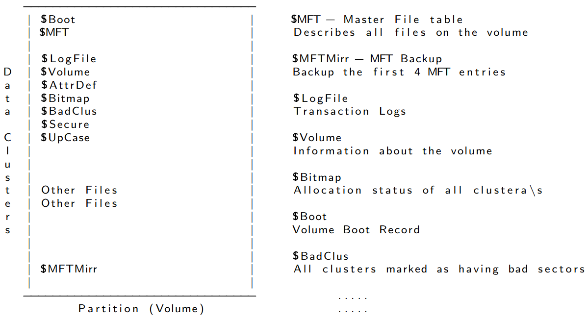
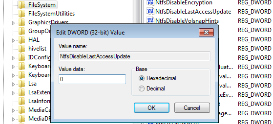
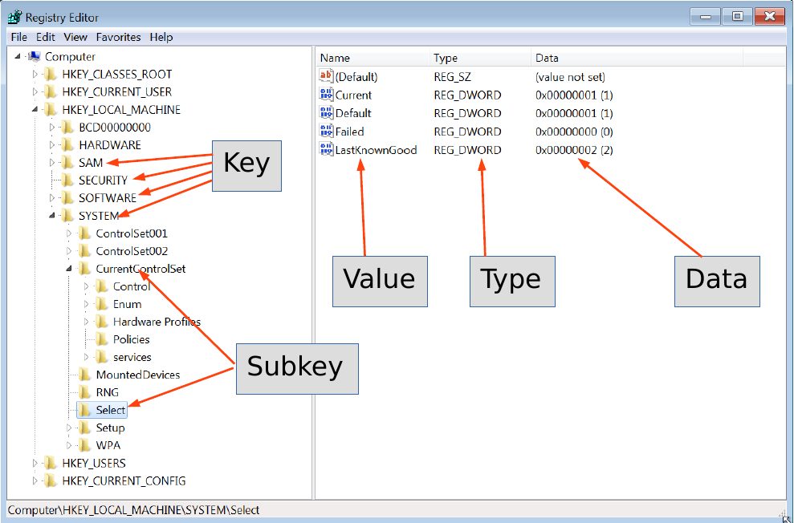
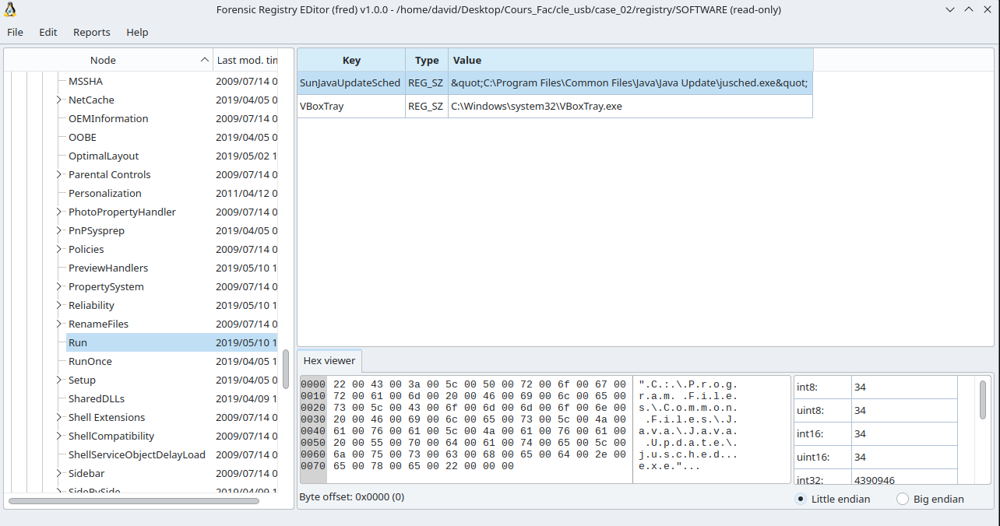
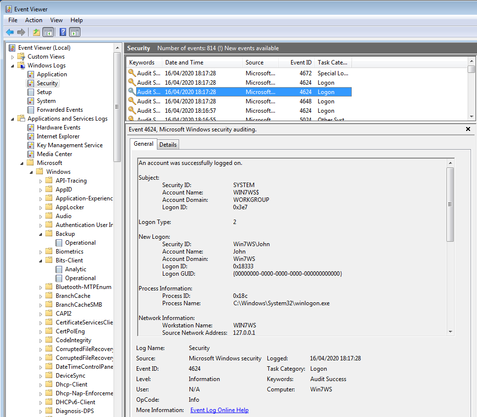

## Overview

- ~~1. Introduction - (*Course 1*)~~
- ~~2. Understand disk - (*Course 1*)~~
- ~~3. Imaging / Cloning and Mounting - (*Course 1*)~~
- 4. File system analysis - (*Course 2*)
- 5. NTFS - (*Course 2*)
- 6. File System Time Line - (*Course 2*)
- 7. Carving and String Search - (*Course 2*)
- 8. Windows Registry - (*Course 2*)
- 9. Windows Event Logs - (*Course 2*)
- 10. Other Windows Artifacts - (*Course 2*)
- 11. Introduction to Flowintel - (*Course 3*)
- 12. The Exercise - (*Course 3*)


# 4. File System Analysis
## 4.1 Organizing data in files
\AddToHookNext{env/Highlighting/begin}{\tiny}
```default
             - Organizing data on a volume
             - Maintain file related meta data
             - Maintain allocation status of clusters
                            

                Metadata                                   Content     
    ----------------------------------       ----------------------------------
  1 |                                |       |                                | 5001
    |                                |       |                                | 5002
    |                                |       |                                | 5003
    |                                |       |                                | 5004
    |                                |       |                                | 5005
    |--------------------------------|       |                                | 5006
  2 |                                |       |                                | ...
    |                                |       |                                | ...
    |                                |       |                                | ...
    |                                |       |                                | ...
    |                                |       |                                | ...
    ----------------------------------       |                                | ...
  3 |                                |       |                                | ...
    |             .....              |       |                                | 5014
    ----------------------------------       ----------------------------------
                                              |       |       |       |      |
                                              0       8      16      24     31

       Allocation table:
```

## 4.1 Organizing data in files
\AddToHookNext{env/Highlighting/begin}{\tiny}
```default
             - Organizing data on a volume
             - Maintain file related meta data
             - Maintain allocation status of clusters
                            

                Metadata                                   Content     
    ----------------------------------       ----------------------------------
  1 |                                |       |11111111111111111111111111111111| 5001
    |                                |       |11111111111111111111111111111111| 5002
    |                                |       |1111                            | 5003
    |                                |       |                                | 5004
    |                                |       |                                | 5005
    |--------------------------------|       |                                | 5006
  2 |                                |       |                                | ...
    |                                |       |                                | ...
    |                                |       |                                | ...
    |                                |       |                                | ...
    |                                |       |                                | ...
    ----------------------------------       |                                | ...
  3 |                                |       |                                | ...
    |             .....              |       |                                | 5014
    ----------------------------------       ----------------------------------
                                              |       |       |       |      |
                                              0       8      16      24     31


       Allocation table:
```

## 4.1 Organizing data in files
\AddToHookNext{env/Highlighting/begin}{\tiny}
```default
             - Organizing data on a volume
             - Maintain file related meta data
             - Maintain allocation status of clusters
                            

                Metadata                                   Content     
    ----------------------------------       ----------------------------------
  1 | Filename: file01.txt           |       |11111111111111111111111111111111| 5001
    | Time stamps: MACB              |       |11111111111111111111111111111111| 5002
    | Rights: Owner, Group, All      |       |1111                            | 5003
    | Size: 68 Byte                  |       |                                | 5004
    | Clusters: 5001,5002,5003       |       |                                | 5005
    |--------------------------------|       |                                | 5006
  2 |                                |       |                                | ...
    |                                |       |                                | ...
    |                                |       |                                | ...
    |                                |       |                                | ...
    |                                |       |                                | ...
    ----------------------------------       |                                | ...
  3 |                                |       |                                | ...
    |             .....              |       |                                | 5014
    ----------------------------------       ----------------------------------
                                              |       |       |       |      |
                                              0       8      16      24     31


       Allocation table: 5001, 5002, 5003
```

## 4.1 Organizing data in files
\AddToHookNext{env/Highlighting/begin}{\tiny}
```default
             - Organizing data on a volume
             - Maintain file related meta data
             - Maintain allocation status of clusters
                            

                Metadata                                   Content     
    ----------------------------------       ----------------------------------
  1 | Filename: file01.txt           |       |11111111111111111111111111111111| 5001
    | Time stamps: MACB              |       |11111111111111111111111111111111| 5002
    | Rights: Owner, Group, All      |       |1111                            | 5003
    | Size: 68 Byte                  |       |22222222222222222222222222222222| 5004
    | Clusters: 5001,5002,5003       |       |22222222222222222222222         | 5005
    |--------------------------------|       |                                | 5006
  2 | Filename: file02.txt           |       |                                | ...
    | Time stamps: MACB              |       |                                | ...
    | Rights: Owner, Group, All      |       |                                | ...
    | Size: 55 Byte                  |       |                                | ...
    | Clusters: 5004, 5005           |       |                                | ...
    ----------------------------------       |                                | ...
  3 |                                |       |                                | ...
    |             .....              |       |                                | 5014
    ----------------------------------       ----------------------------------
                                              |       |       |       |      |
                                              0       8      16      24     31


       Allocation table: 5001, 5002, 5003, 5004, 5005
```


## 4.2 Deleting a file
\AddToHookNext{env/Highlighting/begin}{\tiny}
```default
             - Organizing data on a volume
             - Maintain file related meta data
             - Maintain allocation status of clusters
                            

                Metadata                                   Content     
    ----------------------------------       ----------------------------------
  1 | Filename: file01.txt           |       |11111111111111111111111111111111| 5001
    | Time stamps: MACB              |       |11111111111111111111111111111111| 5002
    | Rights: Owner, Group, All      |       |1111                            | 5003
    | Size: 68 Byte                  |       |22222222222222222222222222222222| 5004
    | Clusters: 5001,5002,5003       |       |22222222222222222222222         | 5005
    |--------------------------------|       |                                | 5006
  2 | Filename: file02.txt (deleted) |       |                                | ...
    | Time stamps: MACB              |       |                                | ...
    | Rights: Owner, Group, All      |       |                                | ...
    | Size: 55 Byte                  |       |                                | ...
    | Clusters: 5004, 5005           |       |                                | ...
    ----------------------------------       |                                | ...
  3 |                                |       |                                | ...
    |             .....              |       |                                | 5014
    ----------------------------------       ----------------------------------
                                              |       |       |       |      |
                                              0       8      16      24     31


       Allocation table: 5001, 5002, 5003
```

## 4.3 Slack space - FileSlack
\AddToHookNext{env/Highlighting/begin}{\tiny}
```default
             - Metadata: Case 1: Re-Use Metadata
             - Content: End of sector: Filled with zeros (RAM slack)
	         - Content: End of cluter: Don't touch (File slack)
                            

                Metadata                                   Content     
    ----------------------------------       ----------------------------------
  1 | Filename: file01.txt           |       |11111111111111111111111111111111| 5001
    | Time stamps: MACB              |       |11111111111111111111111111111111| 5002
    | Rights: Owner, Group, All      |       |1111                            | 5003
    | Size: 68 Byte                  |       |3333333333      2222222222222222| 5004
    | Clusters: 5001,5002,5003       |       |22222222222222222222222         | 5005
    |--------------------------------|       |                                | 5006
  2 | Filename: file03.txt           |       |                                | ...
    | Time stamps: MACB              |       |                                | ...
    | Rights: Owner, Group, All      |       |                                | ...
    | Size: 10 Byte                  |       |                                | ...
    | Clusters: 5004                 |       |                                | ...
    ----------------------------------       |                                | ...
  3 |                                |       |                                | ...
    |             .....              |       |                                | 5014
    ----------------------------------       ----------------------------------
                                              |       |       |       |      |
                                              0       8      16      24     31
 

       Allocation table: 5001, 5002, 5003, 5004
```

## 4.3 Slack space - FileSlack
\AddToHookNext{env/Highlighting/begin}{\tiny}
```default
             - Metadata: Case 2: New Metadata
             - Content: End of sector: Filled with zeros (RAM slack)
	         - Content: End of cluter: Don't touch (File slack)
                            

                Metadata                                   Content     
    ----------------------------------       ----------------------------------
  1 | Filename: file01.txt           |       |11111111111111111111111111111111| 5001
    | Time stamps: MACB              |       |11111111111111111111111111111111| 5002
    | Rights: Owner, Group, All      |       |1111                            | 5003
    | Size: 68 Byte                  |       |3333333333      2222222222222222| 5004
    | Clusters: 5001,5002,5003       |       |22222222222222222222222         | 5005
    |--------------------------------|       |                                | 5006
  2 | Filename: file02.txt (deleted) |       |                                | ...
    | Time stamps: MACB              |       |                                | ...
    | Rights: Owner, Group, All      |       |                                | ...
    | Size: 55 Byte                  |       |                                | ...
    | Clusters: 5004, 5005           |       |                                | ...
    ----------------------------------       |                                | ...
  3 | Filename: file03.txt           |       |                                | ...
    | Time stamps: MACB              |       |                                | 5014
    | Rights: Owner, Group, All      |       ----------------------------------
    | Size: 10 Byte                  |        |       |       |       |      |
    | Clusters: 5004                 |        0       8      16      24     31
    ----------------------------------

       Allocation table: 5001, 5002, 5003, 5004
```

## 4.4 Data Recovery
\AddToHookNext{env/Highlighting/begin}{\tiny}
```default
             # Recover sectors
             # Read from disk and write into a file
	         dd if=deleted.raw of=file02.txt bs=32 skip=5003 count=2
                            

                Metadata                                   Content     
    ----------------------------------       ----------------------------------
  1 | Filename: file01.txt           |       |11111111111111111111111111111111| 5001
    | Time stamps: MACB              |       |11111111111111111111111111111111| 5002
    | Rights: Owner, Group, All      |       |1111                            | 5003
    | Size: 68 Byte                  |       |3333333333      2222222222222222| 5004
    | Clusters: 5001,5002,5003       |       |22222222222222222222222         | 5005
    |--------------------------------|       |                                | 5006
  2 | Filename: file02.txt (deleted) |       |                                | ...
    | Time stamps: MACB              |       |                                | ...
    | Rights: Owner, Group, All      |       |                                | ...
    | Size: 55 Byte                  |       |                                | ...
    | Clusters: 5004, 5005           |       |                                | ...
    ----------------------------------       |                                | ...
  3 | Filename: file03.txt           |       |                                | ...
    | Time stamps: MACB              |       |                                | 5014
    | Rights: Owner, Group, All      |       ----------------------------------
    | Size: 10 Byte                  |        |       |       |       |      |
    | Clusters: 5004                 |        0       8      16      24     31
    ----------------------------------

       Allocation table: 5001, 5002, 5003, 5004
```


## 4.4 Data Recovery
\AddToHookNext{env/Highlighting/begin}{\tiny}
```default
	         # Recover exisiting (deleted) file
             # Based on metadata
	         icat deleted.raw 3 > file03.txt
                            

                Metadata                                   Content     
    ----------------------------------       ----------------------------------
  1 | Filename: file01.txt           |       |11111111111111111111111111111111| 5001
    | Time stamps: MACB              |       |11111111111111111111111111111111| 5002
    | Rights: Owner, Group, All      |       |1111                            | 5003
    | Size: 68 Byte                  |       |3333333333      2222222222222222| 5004
    | Clusters: 5001,5002,5003       |       |22222222222222222222222         | 5005
    |--------------------------------|       |                                | 5006
  2 | Filename: file02.txt (deleted) |       |                                | ...
    | Time stamps: MACB              |       |                                | ...
    | Rights: Owner, Group, All      |       |                                | ...
    | Size: 55 Byte                  |       |                                | ...
    | Clusters: 5004, 5005           |       |                                | ...
    ----------------------------------       |                                | ...
  3 | Filename: file03.txt (deleted) |       |                                | ...
    | Time stamps: MACB              |       |                                | 5014
    | Rights: Owner, Group, All      |       ----------------------------------
    | Size: 10 Byte                  |        |       |       |       |      |
    | Clusters: 5004                 |        0       8      16      24     31
    ----------------------------------

       Allocation table: 5001, 5002, 5003
```

## 4.4 Data Recovery
\AddToHookNext{env/Highlighting/begin}{\tiny}
```default
	         # Recover overwritten file
             # Based on metadata
	         icat deleted.raw 2 > file02.txt
                            

                Metadata                                   Content     
    ----------------------------------       ----------------------------------
  1 | Filename: file01.txt           |       |11111111111111111111111111111111| 5001
    | Time stamps: MACB              |       |11111111111111111111111111111111| 5002
    | Rights: Owner, Group, All      |       |1111                            | 5003
    | Size: 68 Byte                  |       |3333333333      2222222222222222| 5004
    | Clusters: 5001,5002,5003       |       |22222222222222222222222         | 5005
    |--------------------------------|       |                                | 5006
  2 | Filename: file02.txt (deleted) |       |                                | ...
    | Time stamps: MACB              |       |                                | ...
    | Rights: Owner, Group, All      |       |                                | ...
    | Size: 55 Byte                  |       |                                | ...
    | Clusters: 5004, 5005           |       |                                | ...
    ----------------------------------       |                                | ...
  3 | Filename: file03.txt (deleted) |       |                                | ...
    | Time stamps: MACB              |       |                                | 5014
    | Rights: Owner, Group, All      |       ----------------------------------
    | Size: 10 Byte                  |        |       |       |       |      |
    | Clusters: 5004                 |        0       8      16      24     31
    ----------------------------------

       Allocation table: 5001, 5002, 5003
```


## 4.5 The Sleuth Kit
\AddToHookNext{env/Highlighting/begin}{\tiny}
```default
mmstat	# Volume system information
mmls		# List partition table
mmcat		# Cat a partition

fsstat	# File system information

fls		# List files and directories
fcat		# Cat a file
ffind		# Find filename of an inode

istat		# Inode information
ils		# List inodes
icat		# Cat an inode
ifind		# Find inode of a sector

blkstat	# Information of a data unit
blkls		# Output data units
blkcat	# Cat a data unit

jls		# List content of journal
jcat		# Cat a block from journal

mactime	# File system time line
srch_strings	# Display printable characters
hfind		# Hash database lookup
....
```

## 4.5 The Sleuth Kit: Exercise
Recover deleted files from `/carving/deleted.dd`
\AddToHookNext{env/Highlighting/begin}{\tiny}
```default
# File system information
$ 


# List files
$ 


# Recover files based on inode numbers
$ 
$ 
$ 
```

## 4.5 The Sleuth Kit: Exercise
Recover deleted files from `/carving/deleted.dd`
\AddToHookNext{env/Highlighting/begin}{\tiny}
```default
# File system information
$ fsstat deleted.dd
    FILE SYSTEM INFORMATION
    --------------------------------------------
    File System Type: NTFS
    Volume Serial Number: 4978FE7D06B65661
    OEM Name: NTFS
    Version: Windows XP

    CONTENT INFORMATION
    --------------------------------------------
    Sector Size: 512
    Cluster Size: 4096

# List files
$ 


# Recover files based on inode numbers
$ 
$ 
$ 
```

## 4.5 The Sleuth Kit: Exercise
Recover deleted files from `/carving/deleted.dd`
\AddToHookNext{env/Highlighting/begin}{\tiny}
```default
# File system information
$ fsstat deleted.dd
    FILE SYSTEM INFORMATION
    --------------------------------------------
    File System Type: NTFS
    Volume Serial Number: 4978FE7D06B65661
    OEM Name: NTFS
    Version: Windows XP

    CONTENT INFORMATION
    --------------------------------------------
    Sector Size: 512
    Cluster Size: 4096

# List files
$ fls -r deleted.dd
    .....
    + -/r * 70-128-2:	aware.jpg
    + -/r * 71-128-2:	cases.jpg
    + -/r * 72-128-2:	circl.png
    .....

# Recover files based on inode numbers
$ 
$ 
$ 
```

## 4.5 The Sleuth Kit: Exercise
Recover deleted files from `/carving/deleted.dd`

{height=160pt}


# 5. NTFS
## 5.1 File system structure
- NTFS - New Technology File System
- Everything is a file

{height=150pt}

## 5.2 Volume Boot Record
\AddToHookNext{env/Highlighting/begin}{\tiny}
```default
     00000000: eb52 904e 5446 5320 2020 2000 0208 0000  .R.NTFS    .....
     00000010: 0000 0000 00f8 0000 0000 0000 0000 0000  ................
     00000020: 0000 0000 8000 8000 fff7 0300 0000 0000  ................
     00000030: 0400 0000 0000 0000 7f3f 0000 0000 0000  .........?......
     00000040: f600 0000 0100 0000 f92d c409 2fce 776f  .........-../.wo
     00000050: 0000 0000 0e1f be71 7cac 22c0 740b 56b4  .......q|.".t.V.
     00000060: 0ebb 0700 cd10 5eeb f032 e4cd 16cd 19eb  ......^..2......
     00000070: fe54 6869 7320 6973 206e 6f74 2061 2062  .This is not a b
     00000080: 6f6f 7461 626c 6520 6469 736b 2e20 506c  ootable disk. Pl
     00000090: 6561 7365 2069 6e73 6572 7420 6120 626f  ease insert a bo
     000000a0: 6f74 6162 6c65 2066 6c6f 7070 7920 616e  otable floppy an
       .....
     000001e0: 0000 0000 0000 0000 0000 0000 0000 0000  ................
     000001f0: 0000 0000 0000 0000 0000 0000 0000 55aa  ..............U.


      Offset: Length:    Content:   Description:
      -------------------------------------------------------------------
        0000       3      JMP 52    Jump to bootcode at 54h
        0003       8        NTFS    OEM ID
 -----  000B       2       00 02    Bytes per sector
 BIOS   000D       1          08    Sectors per cluster
 P.M.   0028       8   fff7 0300    262135 sectors in total
 Block  0030       8          04    MFT start cluster
 -----  0040       1          f6    Size of MFT records: 10 --> 2^10 = 1.024
        0054     426                Bootstrap code
        01FE       2       55 AA    End of sector signature
```

## 5.3 Master File Table
- MFT maintain 1 record per file/directory
- Size: 1024 Bytes per record
- In NTFS everything is a file
    - Incl. meta files like \$MFT
- Structure: 
\AddToHookNext{env/Highlighting/begin}{\tiny}
```default
    Header        Attributes   End           Empty            Error
    ----------- ----------  ------------------------  --------------
    |FILE         |            | FF FF FF FF |                |    |
    ----------- ----------  ------------------------  --------------
    0          55 56           ~450                                1023

    Record Header:
        Signature: FILE
        Link Count: File is listed in x directories
        Is this a file or a directory
        Size of the file
        Deleted: Is the file already deleted
    Attributes: $STANDARD_INFORMATION; $FILE_NAME; $Data
    End of Recort: FF FF FF FF
    Empty (Resident Data)
    Error Check Sequence
```

## 5.3 MFT
\AddToHookNext{env/Highlighting/begin}{\tiny}
```default
$ istat -o 2048 ntfs.raw 73 | less

$STANDARD_INFORMATION Attribute Values:
    Flags: Archive
    Owner ID: 0
    Security ID: 0  ()
    Created:        2019-12-02 16:25:22.099440400 (CET)
    File Modified:  2019-12-09 16:09:46.183651100 (CET)
    MFT Modified:   2019-12-09 16:09:46.183651100 (CET)
    Accessed:       2019-12-02 16:25:22.099440400 (CET)

$FILE_NAME Attribute Values:
    Flags: Archive
    Name: small_text_file.txt
    Parent MFT Entry: 5     Sequence: 5
    Allocated Size: 16384           Actual Size: 0
    Created:        2019-12-02 16:25:22.099440400 (CET)
    File Modified:  2019-12-02 16:25:22.099440400 (CET)
    MFT Modified:   2019-12-02 16:25:22.099440400 (CET)
    Accessed:       2019-12-02 16:25:22.099440400 (CET)

Attributes:
    Type: $STANDARD_INFORMATION (16-0)   Name: N/A   Resident   size: 48
    Type: $FILE_NAME (48-3)   Name: N/A   Resident   size: 104
    Type: $SECURITY_DESCRIPTOR (80-1)   Name: N/A   Resident   size: 80
    Type: $DATA (128-2)   Name: N/A   Non-Resident   size: 15000  init_size: 15000
    4169 4170 4171 4172
```

## 5.4 Deleting a file: What will change?
\AddToHookNext{env/Highlighting/begin}{\tiny}
```default
Before delete:
==============
  
MFT record:
-----------

00000000: 4649 4c45 3000 0300 0000 0000 0000 0000  FILE0...........
00000010: 0100 0100 3800 0100 b801 0000 0004 0000  ....8...........
00000020: 0000 0000 0000 0000 0400 0000 4900 0000  ............I...
00000030: 1300 0000 0000 0000 1000 0000 4800 0000  ............H...
00000040: 0000 0000 0000 0000 3000 0000 1800 0000  ........0.......
.....
000003f0: 0000 0000 0000 0000 0000 0000 0000 1300  ................


 offset:     size:    value:   description:
----------------------------------------------------------------------
    0010         2         1   Record sequence number
    0012         2         1   Link count
    0016         2         1   Record flag: 0000 = file deleted
	                                    0100 = file in use
				            0200 = dir deleted
                                            0300 = dir in use
    0030         2      1100   FixUp values
    03fe         2      1300   CRC
```

## 5.4 Deleting a file: What will change?
\AddToHookNext{env/Highlighting/begin}{\tiny}
```default
After delete:
=============
  
MFT record:
-----------

00000000:  4649   4c45  3000  0300  0000 0000 0000  0000   FILE0...........
00000010: -0200- -0000- 3800 -0000- b801 0000 0004  0000   ....8...........
00000020:  0000   0000  0000  0000  0400 0000 4900  0000   ............I...
00000030: -1400-  0000  0000  0000  1000 0000 4800  0000   ............H...
00000040:  0000   0000  0000  0000  3000 0000 1800  0000   ........0.......
.....
000003f0:  0000   0000  0000  0000  0000 0000 0000 -1400-  ................


 offset:     size:    value:   description:
----------------------------------------------------------------------
    0010         2         2   Record sequence number
    0012         2         0   Link count
    0016         2         0   Record flag: 0000 = file deleted
	                                    0100 = file in use
				            0200 = dir deleted
                                            0300 = dir in use
    0030         2      1400   FixUp values
    03fe         2      1400   CRC
```


# 6. File System Time Line
## 6.1 Time stamps: Nomenclature
- FAT
    - MAC times
        - M time: Content last Modified
        - A time: Content last Accessed
        - C time: File Created
- NTFS
    - MACE times
        - M time: Content last Modified
        - A time: Content last Accessed
        - C time: File Created
        - E time: MFT Entry last mofidied
    - MACB times
        - M time: Content last Modified
        - A  time: Content last Accessed
        - C  time: MFT record last Changed
        - B  time: File created (Born)

## 6.2 Last Access Time
- \small Updated in memory, writen to disk after $\approx$ 1h
- As of Win Vista
    - Not updated per default
        - HKEY LOCAL MACHINE/SYSTEM/CurrentControlSet/Control/
/FileSystem/NtfsDisableLastAccessUpdate
        - {height=60pt}
        - Performance reasons
        - Good for file server
    - Still updated some times
        - File new created
        - File copied
        - File moved


## 6.3 Time Line: Exercise
\AddToHookNext{env/Highlighting/begin}{\footnotesize}
```default
Reproduce file system activities
--------------------------------
  
     Thu Jun 27 2013 12:23:08      113 ...b         35-128-1 c:/01.txt
     Thu Jun 27 2013 12:24:20       75 m.cb         37-128-1 c:/02.txt
     Thu Jun 27 2013 12:25:24       75 m.cb         38-128-1 c:/03.txt
                                    75 m...         41-128-1 c:/03-copy.txt
     Thu Jun 27 2013 12:26:05       75 m..b         39-128-1 c:/44.txt
     Thu Jun 27 2013 12:27:00       75 macb         40-128-1 c:/05.txt (deleted)
     Thu Jun 27 2013 12:33:50      113 m.c.         35-128-1 c:/01.txt
     Thu Jun 27 2013 13:07:52       75 .acb         41-128-1 c:/03-copy.txt
     Thu Jun 27 2013 13:10:36       75 ..c.         39-128-1 c:/44.txt
     Thu Jun 27 2013 13:14:20       20 m...         42-128-1 c:/06.txt
     Thu Jun 27 2013 13:56:30       20 .acb         42-128-1 c:/06.txt
```

## 6.3 Time Line: Exercise - What could we reproduce Yes/No
\AddToHookNext{env/Highlighting/begin}{\tiny}
```default
01.txt
      1. 12:23:08 01.txt ...b -> new create                            Yes
      6. 12:29:07 01.txt m.c. -> modified content                          No
      7. 12:33:50 01.txt m.c. -> 2nd modification                      Yes

02.txt
      2. 12:24:20 02.txt m.cb -> new create                            Yes
      8. 12:29:50 02.txt .a.. -> open/access file                          No
      9. 12:30:01 02.txt .a.. -> close                                     No

03.txt, 03 - Copy.txt
      3. 12:25:24 03.txt m.cb -> new create                            Yes
     10. 13:07:52 03.txt .acb -> copy to 03 - Copy.txt                 Yes/No

44.txt
      4. 12:26:05 04.txt m..b -> new create                            Yes
     11. 13:10:36 04.txt ..c. -> rename to 44.txt                      Yes/No

05.txt
      5. 12:27:00 05.txt macb -> new create                            Yes
     14. 13:58:07 05.txt macb -> delete file                               No

06.txt
     12. 13:14:20 06.txt m... -> new created on other drive            Yes/No
     13. 13:56:30 06.txt .acb -> copy to local drive                   Yes
```

## 6.4 Create a Time line
\AddToHookNext{env/Highlighting/begin}{\scriptsize}
```default
$ mkdir time

$ fls -o 2048 -r -m d:/ circl-dfir.dd > time/d.body

          -r    Recursive
          -m    Time machine format
	      D:/   Add D:/ as mountpoint in report


$ cd time

$ mactime -b d.body > d.time

$ less d.time
```

## 6.4 Create a Time line
\AddToHookNext{env/Highlighting/begin}{\scriptsize}
```default
Limit the timeline to the term Paula
------------------------------------

1.   grep -i paula d.body | grep -v FILE_NAME > paula.body

2.   mactime -b paula.body > paula.time

3.   less paula.time


     Wed May 03 2023 16:39:48       48 ...b     114-144-2 d:/Paula (deleted)
                                  1246 macb     115-128-2 d:/Paula/Paula.txt (deleted)
     Wed May 03 2023 16:40:25       48 mac.     114-144-2 d:/Paula (deleted)


Can you tell the story?
------------------------
```


## 6.4 Create a Time line
\AddToHookNext{env/Highlighting/begin}{\scriptsize}
```default
Can you tell the story?
------------------------

1. Wed May 03 2023 16:39:48	Directory 'Paula' created in the root directory

2. Wed May 03 2023 16:39:48	File 'Paula.txt' created in directory 'Paula'

3.				Directory 'Paula' and file 'Paula.txt' got deleted

4. Wed May 03 2023 16:40:25	Directory 'Paula' last access, content/meta modified
				-> Most likely due to file 'Paula.txt deleted
```


# 7. Carving and String Search
## 7.1 Magic Bytes - File signatures
\AddToHookNext{env/Highlighting/begin}{\tiny}
```default
$ xxd MECO-SMILE.pdf | less
0000000: 2550 4446 2d31 2e34 0a25 c7ec 8fa2 0a35  %PDF-1.4.%.....5
...
...
005c4d0: 3431 390a 2525 454f 460a                 419.%%EOF.


$ xxd LU-NCSS-2-EN.pdf | less
00000000: 2550 4446 2d31 2e35 0d25 e2e3 cfd3 0d0a  %PDF-1.5.%......
...
...
0007a7e0: 6566 0d31 3136 0d25 2545 4f46 0d         ef.116.%%EOF.


/etc/scalpel/scalpel.conf
-------------------------

   pdf     y       5000000     %PDF     %EOF\x0d     REVERSE
   pdf     y       5000000     %PDF     %EOF\x0a     REVERSE
```

## 7.2 Carving tools
- Foremost
- Scalpel
    - Based on Foremost
- Bulk Extractor
    - Emails, Email addresses
    - URLs
    - Credit card numbers
    - Social media
    - Telephone numbers
    - ...
- Testdisk - Photorec

## 7.3 Limitations
- Basically file system independent
- Data sequential
    - Data must be sequential
    - Fragmented data leads to broken files
    - Very large files are more fragmented
    - Depends on file system
    - Depends on media type
    - Data could be overwritten partially
- End of file
    - Does the file format support end marker
    - Do we find a new magic byte
    - Overlapping files
    - Empty space at the end of a sector

## 7.4 Exercise: Recover data from formated drive
- Work on `circl-dfir/carving/formated.dd`
- Try `fls`
- `sudo apt install foremost`
- `https://www.cgsecurity.org/wiki/TestDisk_Download`


## 7.4 Exercise: Recover data from formated drive
\AddToHookNext{env/Highlighting/begin}{\tiny}
```default
mkdir out1/ && foremost -t all -i formated.dd -o out1/

out1/audit.txt
--------------

File: deleted.dd
Start: Wed Aug 22 16:20:43 2018
Length: 32 MB (33554432 bytes)

Num      Name (bs=512)         Size      File Offset     Comment
0:      00009032.jpg           5 KB         4624384
1:      00009080.jpg          35 KB         4648960
2:      00037617.jpg          30 KB        19260232
3:      00037678.jpg         106 KB        19291633
.....
16:     00037608.pdf           1 MB        19255296
17:     00041288.pdf         489 KB        21139456       (PDF is Linearized)
Finish: Wed Aug 22 16:20:43 2018
18 FILES EXTRACTED

jpg:= 9
png:= 6
pdf:= 3
```

## 7.5 String Search
- \small Not sophisticated
- Search for strings
    - At least 4 characters long
    - From any file: Text, binary, disk image
    - Search for ASCII, Unicode, big/little endian
- Search the disk image for known words
    - Terms used in a secret document
    - IBAN ot other banking details
    - Email addresses or URLs
- Search through all the blocks
    - Allocated and non allocated blocks
    - File slack and outside partition boundaries
- Goal
    - Proof that the data was there once
    - Identify interesting data that are close


## 7.6 Steps to do a String Search
1. \small Identify block/cluster size\
    `mmls, fsstat`
2. Search for the string and the offset\
    `blkls | srch_strings | grep `
3. Calculate block/cluster of the string\
    `xxxxxxxxxx / 4096 = yyyy`
4. Review block/cluster content\
    `blkcat`
5. Identify inode of the block/cluster\
    `ifind`
6. Identify associated file\
    `ffind`
7. Recover file\
    `icat`\
    Or mount and copy file


# 8. Windows Registry
## 8.1 About Windows Registry
- \small MS DOS and old Windows
	- On system boot: What programs to load
	- How the system interact with the user\
		&rarr; `autoexec.bat`\
		&rarr; `config.sys`\
		&rarr; `system.ini`\
		&rarr; `win.ini`\
- https://support.microsoft.com/en-us/help/256986/
	- A central hierarchical database
	- Replace text based config files
	- Contains information for operating
		- Hardware system wide
		- OS all aspects
		- Applications installed
		- User preferences / behavior

	&rarr; A gold mine for forensics

## 8.1 About Windows Registry
{height=185pt}

## 8.1 About Windows Registry
- Hive files location:
	- `%SystemRoot%\system32\config`\
	&rarr; SAM, SECURITY, SYSTEM, SOFTWARE
	- `%UserProfile%\NTUSER.DAT`
	- `%UserProfile%\AppData\Local\Microsoft\Windows\UsrClass.dat`

## 8.2 Hive files
- \small SAM
	- Security Accounts Manager: Local users
- Security
	- Audit settings
	- Machine, domain SID
- System
	- Hardware configuration
	- System configuration
- Software
	- Windows settings
	- Application information
- NTUser.dat
	- User behavior and settings
- UsrClass.dat
	- Graphical User Interface information

## 8.2 Hive files
- Windows XP:
	- `C:\Documents and Settings\<username>\NTUSER.DAT`
	- `C:\Documents and Settings\<username>\Local Settings\`\
		`Application Data\Microsoft\Windows\UsrClass.dat`


- Windows Vista and above:
	- `C:\Users\<user>\NTUSER.DAT`
	- `C:\Users\<user>\AppData\Local\Microsoft\Windows\`\
		`UsrClass.dat`


- `C:\Windows\inf\setupapi.log` \
	(Plug and Play Log)

## 8.3 RegRipper
- Installation:
	- `sudo apt install regripper`\
	or
	- Install wine
	- Clone https://github.com/keydet89/RegRipper3.0
	- Use rip.exe with wine

## 8.3 RegRipper
\AddToHookNext{env/Highlighting/begin}{\tiny}
```bash
$ regripper -h
	Rip v.3.0 - CLI RegRipper tool	
	Rip [-r Reg hive file] [-f profile] [-p plugin] [options]
	Parse Windows Registry files, using either a single module, or a profile.

```

\AddToHookNext{env/Highlighting/begin}{\tiny}
```bash

$ ls /usr/lib/regripper/plugins | grep pl$ | wc -l
	249


$ ls /usr/lib/regripper/plugins | grep -v pl$
	all
	amcache
	ntuser
	sam
	security
	software
	syscache
	system
	usrclass
```

## 8.3 RegRipper - Exercise
- `circl-dfir/case_02/registry`
- Use regripper to find:
	- Computer name
	- Software that run when a user logs on
	- Informations on Windows
	- Network cards

	<br>

	- List of uninstaller
	- Ips
	- List of users
	- Shutdown
	- Timezone

## 8.3 RegRipper - Solution
- Computer name:
\AddToHookNext{env/Highlighting/begin}{\scriptsize}
```bash
regripper -p compname -r system
```
- Software that run when a user logs on:
\AddToHookNext{env/Highlighting/begin}{\scriptsize}
```bash
regripper -p run -r NTUSER.DAT
regripper -p run -r software 
```

- Informations on Windows:
\AddToHookNext{env/Highlighting/begin}{\scriptsize}
```bash
regripper -p winver -r software
```

- Network cards:
\AddToHookNext{env/Highlighting/begin}{\scriptsize}
```bash
regripper -p networkcards -r software 
```


## 8.3 RegRipper - Solution
- List of uninstaller:
\AddToHookNext{env/Highlighting/begin}{\scriptsize}
```bash
regripper -p uninstall -r software
```

- Ips:
\AddToHookNext{env/Highlighting/begin}{\scriptsize}
```bash
regripper -p ips -r system
```

- List of users:
\AddToHookNext{env/Highlighting/begin}{\scriptsize}
```bash
regripper -p profilelist -r software
```

- Shutdown:
\AddToHookNext{env/Highlighting/begin}{\scriptsize}
```bash
regripper -p shutdown -r system 
```

- Timezone:
\AddToHookNext{env/Highlighting/begin}{\scriptsize}
```bash
regripper -p timezone -r system
```


## 8.4 Tracing user activity
- MRU - Most Recently Used
	- Open/Save As dialog box
\AddToHookNext{env/Highlighting/begin}{\scriptsize}
```bash
regripper -p comdlg32 -r NTUSER.DAT
```
	- Recent Docs opened via Win. Explorer
\AddToHookNext{env/Highlighting/begin}{\scriptsize}
```bash
regripper -p recentdocs -r NTUSER.DAT
```

<br>

- ShellBags (Win7+)
	- Properties of folders
\AddToHookNext{env/Highlighting/begin}{\scriptsize}
```bash
regripper -p shellbags -r UsrClass.dat
```

<br>

- Program execution
	- UserAssist: GUI based launched
\AddToHookNext{env/Highlighting/begin}{\scriptsize}
```bash
regripper -p userassist -r NTUSER.DAT
```
	- ShimCache: Track compatibility issues
\AddToHookNext{env/Highlighting/begin}{\scriptsize}
```bash
regripper -p shimcache -r system
```


## 8.4 Tracing user activity
- USB attached devices
	- USBStor: Attached devices
\AddToHookNext{env/Highlighting/begin}{\scriptsize}
```bash
less /media/case1/WINDOWS/setupapi.log
regripper -p usbstor -r system
```
	- USBStor: Vendor & Product ID
\AddToHookNext{env/Highlighting/begin}{\scriptsize}
```bash
regripper -p usb -r system
```
	- MountedDevices
\AddToHookNext{env/Highlighting/begin}{\scriptsize}
```bash
regripper -p mountdev -r system
```
	- MountPoints
\AddToHookNext{env/Highlighting/begin}{\scriptsize}
```bash
regripper -p mp2 -r NTUSER.DAT
```

<br>

- https://www.sans.org/posters/windows-forensic-analysis/

## 8.5 Fred
https://code.sits.lu/foss/fred
{height=150pt}


# 9. Windows Event Logs
## 9.1 About Windows Event Logs
- Up to Windows XP
	- Mainly 3 .evt files:
		- Security: secevent.evt
		- System: sysevent.evt
		- Application: appevent.evt
	- Location: `/Windows/System32/config/`
	- Binary Event Log file format

- Beginning with Vista
	- Many .evtx files:
		- `Security.evtx`
		- `System.evtx`
		- `Application.evtx`
		- 120 files ++
	- Location: `/Windows/System32/winevt/Logs/`
	- New binary XML format

## 9.1 About Windows Event Logs
- Advantage
	- Full fledged logging
	- Logging important events: E.g. Logon Success, ...
	- Detailed information

- Disadvantage
	- Limited period of time
	- Important events not logged by default: E.g. Logon Fail
	- Many events, hard to find related information

- Always interesting
	- Logon / Logoff
	- System boot
	- Services started
	- Hardware (dis)connected

## 9.1 Windows Event Logs
{height=185pt}

## 9.1 Windows Event Logs
- Review logging policies
\AddToHookNext{env/Highlighting/begin}{\scriptsize}
```bash
$ regripper -r SECURITY -p auditpol
.....
System:Other System Events                         S/F  
Logon/Logoff:Logon                                 S    
Logon/Logoff:Logoff                                S    
Logon/Logoff:Account Lockout                       S    
Logon/Logoff:IPsec Main Mode                       N    
Logon/Logoff:IPsec Quick Mode                      S    
Logon/Logoff:IPsec Extended Mode                   N    
Logon/Logoff:Special Logon                         N    
Logon/Logoff:Other Logon/Logoff Events             N    
Logon/Logoff:Network Policy Server                 S/F  
Object Access:File System                          N    
.....

```

## 9.2 Parsing
\AddToHookNext{env/Highlighting/begin}{\scriptsize}
```bash
sudo apt install libevt-utils
sudo apt install libevtx-utils

evtinfo evtx/AppEvent.Evt
evtinfo evtx/SecEvent.Evt
evtinfo evtx/SysEvent.Evt

evtexport AppEvent.Evt | less
evtexport SysEvent.Evt | less

evtxexport Security.evtx | less

```

- Search for:
	- 4624 
	- 4625


## 9.3 Other tools
- Chainsaw
	- https://github.com/WithSecureLabs/chainsaw

- Hayabusa
	- https://github.com/Yamato-Security/hayabusa


# 10 Other Windows artifacts
## 10.1 Recycle Bin 
- Files move to Recycle Bin:
	- Moved by mouse
	- Right click: Delete
- Not move to Recycle Bin:
	- Right click: `Delete + SHIFT`
	- Command line: `del`
	- Files on network shares
- NukeOnDelete
	`HKEY_USERS/_UUID_/Software/Microsoft/Windows/CurrentVersion/`
	`Explorer/BitBucket/Volume/{_Volume ID_}/NukeOnDelete`


## 10.1 Recycle Bin - Life-Investigate
- Play Script: TextFile.txt
	- Moved with mouse into Recycle Bin
	- 2019-04-30 17:31:57 UTC+2: Born
	- 2019-04-30 17:34:44 UTC+2: Content Modified
	- 2019-04-30 17:35:32 UTC+2: Deleted

## 10.1 Recycle Bin - Forensics
- \small Play Script: TextFile.txt
	- 2019-04-30 17:31:57 UTC+2: Born
	- 2019-04-30 17:34:44 UTC+2: Content Modified
	- 2019-04-30 17:35:32 UTC+2: Deleted

- Analyze Recycle.Bin directory:
\AddToHookNext{env/Highlighting/begin}{\tiny}
```bash
/$Recycle.Bin/S-1-5-21-3408732720-2018246097-660081352-1000/
	129 Apr  5 11:46  desktop.ini
	544 Apr 30 17:35 '$IOMHI9A.txt'
	320 Apr 30 17:34 '$ROMHI9A.txt'


strings -el \$IOMHI9A.txt 
	C:\Users\John\Documents\recycleTest\TestFile.txt


strings \$ROMHI9A.txt 
		Test File
		=========
	This is a test file. It is just created to test Forensic
	Artifacts for the 'Recycle Bin'.
	.....
```

## 10.1 Recycle Bin - Forensics
- \small Play Script: TextFile.txt
	- 2019-04-30 17:31:57 UTC+2: Born
	- 2019-04-30 17:34:44 UTC+2: Content Modified
	- 2019-04-30 17:35:32 UTC+2: Deleted

- File system timeline Recycle.Bin directory:
\AddToHookNext{env/Highlighting/begin}{\tiny}
```bash
Tue Apr 30 2019 17:31:57
     320 ...b   47164-128-1 /$Recycle.Bin/S-1-5-21- ..... -1000/$ROMHI9A.txt


Tue Apr 30 2019 17:34:44
     320 ma..   47164-128-1 /$Recycle.Bin/S-1-5-21- ..... -1000/$ROMHI9A.txt


Tue Apr 30 2019 17:35:32
     544 macb   44155-128-1 /$Recycle.Bin/S-1-5-21- ..... -1000/$IOMHI9A.txt
      48 mac.   47022-144-1 /Users/John/Documents/recycleTest
     320 ..c.   47164-128-1 /$Recycle.Bin/S-1-5-21- ..... -1000/$ROMHI9A.txt
     376 mac.    9632-144-1 /$Recycle.Bin/S-1-5-21- ..... -1000
```

## 10.2 LNK Files
- Link or shortcut to files, applications, resources
- User activity: Files access
	- Local
	- Network shares
	- External devices
- LNK file remain after target file is deleted


## 10.2 LNK Files
- \small Information inside LNK files
	- Target file MAC times
	- Target file size
	- Target file path
	- Volume information

\AddToHookNext{env/Highlighting/begin}{\tiny}
```default
exiftool Test.txt.lnk
	...
	Create Date         : 2019:05:02 14:54:28+02:00
	Access Date         : 2019:05:02 14:54:28+02:00
	Modify Date         : 2019:05:02 14:54:28+02:00
	Target File Size    : 66
	Icon Index          : (none)
	Run Window          : Normal
	Hot Key             : (none)
	Drive Type          : Fixed Disk
	Volume Label        :
	Local Base Path     : C:\Users\
	Net Name            : 8
	Net Provider Type   : Unknown (0x20000)
	Relative Path       : ..\..\..\..\..\Documents\Test\Test.txt
	Working Directory   : C:\Users\John\Documents\Test
	Machine ID          : john-pc
```

## 10.3 Jump Lists
- \small Introduced with Windows 7
- Similar `Recent` folder
- Recently opened documents / application
- Makes them accessible at Windows main menu

{height=90pt}

\scriptsize `AppData/Roaming/Microsoft/Windows/Recent/AutomaticDestinations`
\scriptsize `AppData/Roaming/Microsoft/Windows/Recent/CustomDestinations`

## 10.3 Jump Lists
- File names start with 16 hex characters → JumpList ID
- File names end with .xxxDestinations-ms

\AddToHookNext{env/Highlighting/begin}{\scriptsize}
```default
C:> dir \Users\John\AppData\Roaming\Microsoft\Windows\Recent\AutomaticDestinations

04/05/2020  12:50            33 792 1b4dd67f29cb1962.automaticDestinations-ms
14/06/2019  16:43             4 608 28c8b86deab549a1.automaticDestinations-ms
10/04/2019  14:32            29 696 6824f4a902c78fbd.automaticDestinations-ms
10/04/2020  14:12             9 216 7e4dca80246863e3.automaticDestinations-ms
```
- Each Hex value correspond to a fixed application
- 918e0ecb43d17e23 = Notepad.exe


\scriptsize https://github.com/EricZimmerman/JumpList/blob/master/JumpList/Resources/AppIDs.txt


## 10.3 Jump Lists
- Exercise: Identify applications

\AddToHookNext{env/Highlighting/begin}{\scriptsize}
```default
cd JumpLists/AutomaticDestinations/
ls -l

    1b4dd67f29cb1962.automaticDestinations-ms --> 
    28c8b86deab549a1.automaticDestinations-ms --> 
    6824f4a902c78fbd.automaticDestinations-ms --> 
    7e4dca80246863e3.automaticDestinations-ms --> 
    918e0ecb43d17e23.automaticDestinations-ms --> 
    b74736c2bd8cc8a5.automaticDestinations-ms --> 
    de48a32edcbe79e4.automaticDestinations-ms --> 
```

## 10.3 Jump Lists
- Exercise: Identify applications

\AddToHookNext{env/Highlighting/begin}{\scriptsize}
```default
cd JumpLists/AutomaticDestinations/
ls -l

    1b4dd67f29cb1962.automaticDestinations-ms --> Windows Explorer
    28c8b86deab549a1.automaticDestinations-ms --> Internet Explorer 8
    6824f4a902c78fbd.automaticDestinations-ms --> Firefox 64.x
    7e4dca80246863e3.automaticDestinations-ms --> Control Panel
    918e0ecb43d17e23.automaticDestinations-ms --> Notepad (32-bit)
    b74736c2bd8cc8a5.automaticDestinations-ms --> WinZip
    de48a32edcbe79e4.automaticDestinations-ms --> Acrobat Reader 15.x
```

## 10.4 Prefetch Files
- Application prefetching since XP
	- Monitor an application when it starts
	- Collect information about resources needed
	- Wait 10sec after application started
		&rarr; Know where to find the resources
		&rarr; Better performance: App launch faster
		&rarr; Better user experience

- Forensics value:
	- Proof an application was started
		- Secondary artifact
		- Created by the OS
		- Not deleted by the attacker
	- Even if the application don’t exists anymore
	- ...


## 10.4 Prefetch Files
- Example: From file system time line

\AddToHookNext{env/Highlighting/begin}{\scriptsize}
```default
Thu May 02 2019 14:52:40
    179712 .a..      10940-128-3 /Windows/notepad.exe

Thu May 02 2019 14:52:50
        56 mac.      42729-144-6 /Windows/Prefetch
     16280 macb      43700-128-4 /Windows/Prefetch/NOTEPAD.EXE-D8414F97.pf
```

- Elements of the file name at `/Windows/Prefetch`
	- Application name
	- One way hash of path to the application

- Information found inside a Prefetch file:
	- Run count: How often application run
	- Last time executed
	- Application name incl. parameter
	- Path to application and resources

## 10.4 Prefetch Files
- Parsing a Prefetch file
\AddToHookNext{env/Highlighting/begin}{\scriptsize}
```default
prefetch_parser.py -f NOTEPAD.EXE-D8414F97.pf

	Executable Name: NOTEPAD.EXE
	Run count: 1
	Last Executed: 2019-05-02 12:52:40.339584

	Resources loaded:
	1:    \DEVICE\HARDDISKVOLUME2\WINDOWS\SYSTEM32\NTDLL.DLL
	2:    \DEVICE\HARDDISKVOLUME2\WINDOWS\SYSTEM32\KERNEL32.DLL
	3:    \DEVICE\HARDDISKVOLUME2\WINDOWS\SYSTEM32\APISETSCHEMA.DLL
	4:    \DEVICE\HARDDISKVOLUME2\WINDOWS\SYSTEM32\KERNELBASE.DLL
	.....
	.....
```

- Additional benefits like:
	- User folder where the malware got executed
	- Compare Run count of different VSS could


## 10.5 VSS - Volume Shadow Copy Service
- \small Backup Service
	- System files
	- User data files
	- Operates on block level
- On live system
	- Run CMD as administrator

\AddToHookNext{env/Highlighting/begin}{\tiny}
```default
>vssadmin list shadows /for=c:/
vssadmin 1.1 - Volume Shadow Copy Service administrative command-line tool
(C) Copyright 2001-2005 Microsoft Corp.

Contents of shadow copy set ID: {33eb3a7b-6d03-4045-aa70-37b714d49c72}
   Contained 1 shadow copies at creation time: 10/04/2019 16:06:30
      Shadow Copy ID: {34d9910b-ac1d-4b10-b282-89dde217d0fb}
         Original Volume: (C:)\\?\Volume{a62c8cd4-5786-11e9-a9fd-806e6f6e6963}\
         Shadow Copy Volume: \\?\GLOBALROOT\Device\HarddiskVolumeShadowCopy1
         Originating Machine: Win7WS
         Service Machine: Win7WS
         Provider: 'Microsoft Software Shadow Copy provider 1.0'
         Type: ClientAccessibleWriters
         Attributes: Persistent, Client-accessible, No auto release, Differential,
	 	 Auto recovered
```

## 10.5 VSS - Configuration & Analysis
`HKEY LOCAL MACHINE/SYSTEM/CurrentControlSet/services/VSS`

`HKEY LOCAL MACHINE/SYSTEM/CurrentControlSet/Control/BackupRestore`

- Analyze disk image:\
`vshadowinfo -o offset disk_image`

- Mount VSS:\
`vshadowmount -o offset disk_image mount_point`


## Contact and Reference
- david.cruciani@circl.lu

- https://github.com/DavidCruciani

- info@circl.lu