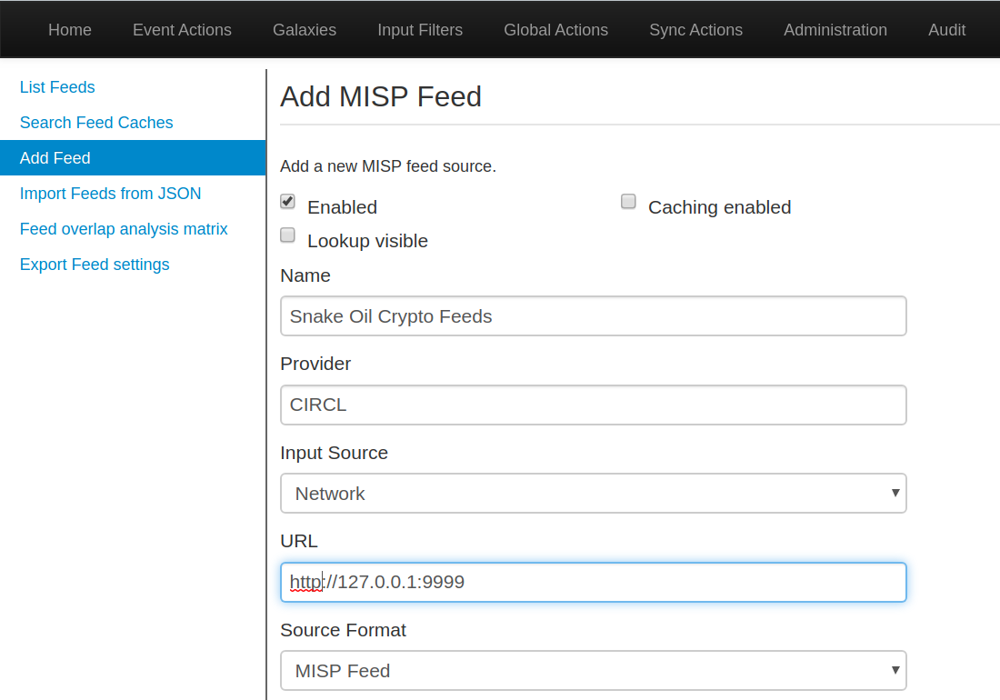
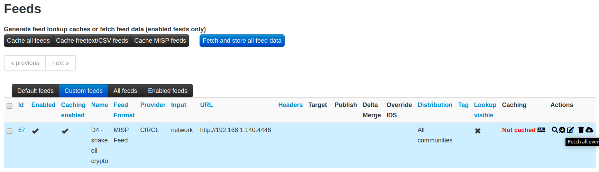
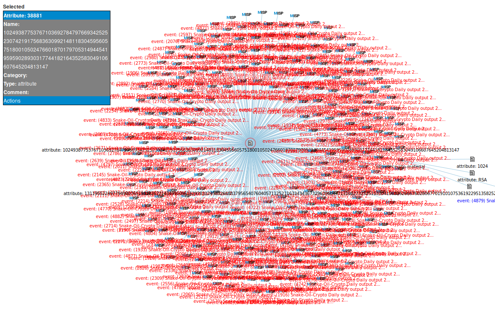

# Instructions

## Download MISP VM
Snake-oil-crypto output can export its results to
[MISP](https://misp-project.org) through the MISP exporter. The current training
virtual machine does not include [MISP](https://misp-project.org). Instead, we
should download and import an up-to-date version of the OVA file at the
[following location](https://www.circl.lu/misp-images/latest/).
[See instructions here](https://www.misp-project.org/download/)

## Set up the feed for MISP

In order to feed MISP with snake-oil-crypto generated event the easiest is to use python:
* extract the content of `output.zip`,
* serve its content with python:
```shell
python -m SimpleHTTPServer 9999
```

## Pull the events from MISP

In MISP, while logged in as admin: 
* go into: `Sync Actions>List Feeds`,
* on the left-end column click on `Add Feed`,
* point the url of your feed to the location where you are serving it (see for instance the figure below)



* once done, click on the `Custom feeds` tab, and click on the `fetch all events` action button on the right-end side.



A worker will fetch all the event into MISP, and after a little while, a lot of new event should populate your event list.

## Explore events

Using MISP's correlation engine, answer the following question:

* which are the vendor we should notify?


