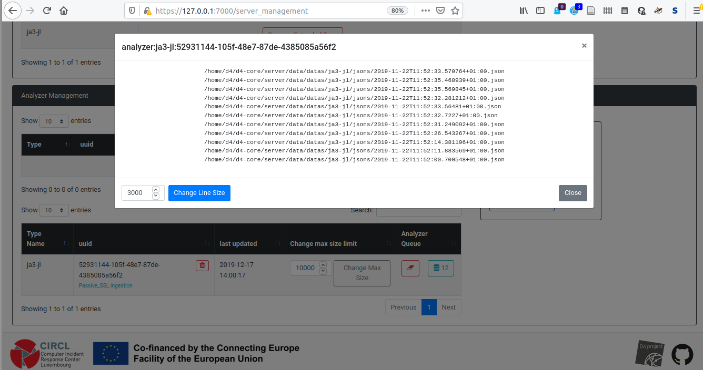
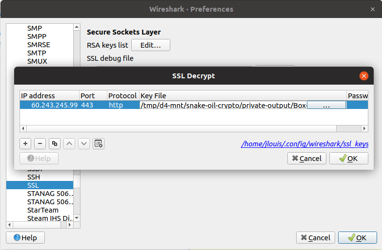

# Instructions

## Setup

The current folder contains a `stripped.pcap` file that is a network capture of
a HTTPS interaction between a client (`10.0.2.15`) and a device located at
`60.243.245.99`. The goal of this challenge is to acquire the admin password
exchanged during this TLS session.

The only clue we have by connecting to this box, is that it is a Huawei equipment.

## D4-project introduction

[D4 project](https://d4-project.org/) aims at collect and centralize data for
analysis. A good overview of the project can be found in its [architecture
repository](https://github.com/d4-project/architecture).

In particular we will make use of:
* [sensor-d4-tls-fingerprinting)](https://github.com/D4-project/sensor-d4-tls-fingerprinting): that is a tool that extracts x509 certificates from pcap and network interfaces, and outputs the results in JSON
* [d4-goclient)](https://github.com/D4-project/d4-goclient): that is a tool that stream data to a d4-core server
* [d4-core)](https://github.com/D4-project/d4-core): that is a tool that collect data from d4 clients, and manages analises on these data
* [analyzer-d4-passivessl)](https://github.com/D4-project/analyzer-d4-passivessl): that is a tool used to store sensor-d4-tls-fingerprinting data stream into a postgreSQL database 
* [snake-oil-crypto)](https://github.com/D4-project/snake-oil-crypto): that is a tool that work on the said database to identify cryptographic weaknesses, create private keys, and export the results to MISP. 

In the setting of this challenge, using d4 and the whole passive_ssl /
snake-oil-crypto pipeline is overkill. But you may find it useful if you collect
loads of pcaps containing TLS connections during in your investigations.

The provided virtual machine already contains the needed piece of software along
with the configuration files. In the following we explain what commands to run
this pipeline step-by-step, the installation and full description of each
components will be available at a later date in blog post hosted on D4 project's
[website](https://d4-project.org).

The d4-core server should already running. It should be available at
https://127.0.0.1:7000/ from your host machine (admin@admin.test / Password1234).
If the server is not running, do the following to launch it:

```shell
cd d4-core/server/
./LAUNCH.sh -l
```

## Ingesting pcaps

Place yourself in d4 user's home:

```shell
cd ~
```
Then call sensor-d4-tls-fingerprinting to parse stripped.pcap, and pipe the result into d4
```shell
sensor-d4-tls-fingerprinting -r hands-on/TLSinspection/stripped.pcap | d4-goclient -c conf.sensor/
```
`conf.sensor` contains the file needed to send the data stream in the right format to the right d4 server (on localhost).
Checking the d4 server's landing page, you should see 18 new types 254 packets received.
This packets contains json files describes 12 TLS connections parsed by the sensor.
They should appear in the [server management page](https://127.0.0.1:7000/server_management), see the figure below.



## Analyzing pcaps

The next step is pushing these 12 TLS connections description in
snake-oil-crypto postgreSQL database to prepare the next step.
The database is already running, we just need to enter the following:

```shell
cd ~
analyzer-d4-passivessl -c conf.analyzer/
```
The conf.analyzer contains the configuration files required for the analyzer to perform its job, you should see the following output:

```shell
d4@d4-server:~$ analyzer-d4-passivessl -c conf.analyzer/
/home/d4/d4-core/server/data/datas/ja3-jl/jsons/2019-11-22T11:52:33.570764+01:00.json
/home/d4/d4-core/server/data/datas/ja3-jl/jsons/2019-11-22T11:52:35.468939+01:00.json
/home/d4/d4-core/server/data/datas/ja3-jl/jsons/2019-11-22T11:52:35.569845+01:00.json
/home/d4/d4-core/server/data/datas/ja3-jl/jsons/2019-11-22T11:52:32.281212+01:00.json
/home/d4/d4-core/server/data/datas/ja3-jl/jsons/2019-11-22T11:52:33.56481+01:00.json
/home/d4/d4-core/server/data/datas/ja3-jl/jsons/2019-11-22T11:52:32.7227+01:00.json
/home/d4/d4-core/server/data/datas/ja3-jl/jsons/2019-11-22T11:52:31.249092+01:00.json
/home/d4/d4-core/server/data/datas/ja3-jl/jsons/2019-11-22T11:52:26.543267+01:00.json
/home/d4/d4-core/server/data/datas/ja3-jl/jsons/2019-11-22T11:52:14.381196+01:00.json
/home/d4/d4-core/server/data/datas/ja3-jl/jsons/2019-11-22T11:52:11.883569+01:00.json
/home/d4/d4-core/server/data/datas/ja3-jl/jsons/2019-11-22T11:52:00.700548+01:00.json
/home/d4/d4-core/server/data/datas/ja3-jl/jsons/2019-11-22T11:51:40.844664+01:00.json
```

snake-oil-crypto database now contains the cryptographic material needed to check
whether it is possible the retrieve the private key of this TLS connection (the
database in this VM contains 3 millions other certificates, 98000+ of which
will be involved in the following attack).

## Testing Crypto materials

In the following step, we will make use of snake-oil-crypto.
Frist we need to check if it is already running:

```shell
cd ~/snake-oil-crypto
screen -ls
```
screen listing's output should contain, in addition to d4-server session, a session related to snake-oil-crypto:
```shell
There are screens on:
	1539.Snake_Oil_Crypto_Window	(12/17/19 14:12:31)	(Detached)
	1036.Flask_D4	(12/17/19 13:48:37)	(Detached)
	1004.Workers_D4	(12/17/19 13:48:36)	(Detached)
	975.Server_D4	(12/17/19 13:48:35)	(Detached)
	736.Redis_D4	(12/17/19 13:48:33)	(Detached)
5 Sockets in /run/screen/S-d4.
```
In the event were the snake-oil-entry is missing simply call:
```shell
./start_screen.sh
```

Now that the screen is running, we can attach it by inputing:
```shell
screen -r Snake_Oil_Crypto_Window
```
You are now into snake-oil-crypto screen:
* `CTRL+A D` detaches the screen (you can reattach it by retyping the previous command)
* `CTRL+A "` list the available windows, one is Worker-1, which is were a sagemath worker is running to execute the some we will submit
 by retyping the previous command

Now to if a private key is computable from our database, go in the other window (the first one) and execute the following:
```shell
sage TLSinspection.py
```
This script (explore it!) does the following:

* fetches the postgreSQL database to get the RSA modulus corresponding to the ip `60.243.245.99`,
* creates an searchGCD attack job: this attack computes the Greatest Common Divisor for each couple `(target_key, every_other_supplied_key)`,
* creates a RSA builder job, that will create a RSA private key from the crypto material recovered if available,
* enqueues the attack job, and supply a subset of the database to test against (every Huawei keys that we know of),
* enqueues the report job that does the reporting into the worker terminal window,
* enqueues the builder job, that will actually build the RSA private key if possible.

If all goes well, you should obtain the follwing in the worker window:

```shell
14:12:31 Worker rq:worker:b5d3fa9d88aa42e2aae66ffb85e3e481: started, version 1.1.0
14:12:31 *** Listening on default...
14:12:31 Cleaning registries for queue: default
14:20:17 default: process(<bound method PassivesslDB.getRSAModuliBySubject of <datastores.passivessldb.PassivesslDB object at 0x7ffb77b3bb00>>, {'subject': 'Huawei'}) (7bd99eae-caf0-4956-bac3-401c11dcb0e6)
Connecting to the PostgreSQL database...
/home/d4/snake-oil-crypto/sage-8.9/local/lib/python3.7/site-packages/sqlalchemy/dialects/postgresql/base.py:3010: SAWarning: Did not recognize type 'ltree' of column 'cert_chain'
  "Did not recognize type '%s' of column '%s'" % (attype, name)
Attacking 2609 keys - a9c54c669a2d8fad0b036affcde4c8043b964afe513de35ffc18d290276c8e59.
with
148131599601580963371631334221696805233982365537357902748680203564663644056321768400383979985887719676829328379293820600508526071292745621169518799456159698994665652836849724280544169537336976603000365878483194308590672998988783311307419700144383415603788017383354074359053876010915443790087180942924474621279
Database connection closed.
14:20:26 default: Job OK (7bd99eae-caf0-4956-bac3-401c11dcb0e6)
14:20:26 Result is kept for 500 seconds
14:20:26 default: report('7bd99eae-caf0-4956-bac3-401c11dcb0e6') (15b102d8-a5cf-42c9-9e55-eb39f93f9e98)
11732312005157263850676568821109189841512649873512622454992175692758921475218783599489943051887246420971822345443755752305322617962229524179190209362626571
is common divisor of 
148131599601580963371631334221696805233982365537357902748680203564663644056321768400383979985887719676829328379293820600508526071292745621169518799456159698994665652836849724280544169537336976603000365878483194308590672998988783311307419700144383415603788017383354074359053876010915443790087180942924474621279. 
14:20:27 default: Job OK (15b102d8-a5cf-42c9-9e55-eb39f93f9e98)
14:20:27 Result is kept for 500 seconds
14:20:27 default: process('15b102d8-a5cf-42c9-9e55-eb39f93f9e98') (d6a13057-7527-4403-b302-dffd075f9249)
Writing key to file /home/d4/snake-oil-crypto/private-output/Box-indian.pem
Done.
14:20:28 default: Job OK (d6a13057-7527-4403-b302-dffd075f9249)
14:20:28 Result is kept for 500 seconds
```

We obtained a private-key!
Let's check it with opennssl:
```shell
openssl rsa -in /home/d4/snake-oil-crypto/private-output/Box-indian.pem -check -text -noout
RSA Private-Key: (1024 bit, 2 primes)
modulus:
    00:d2:f2:47:44:10:fb:b0:f1:ed:d2:fd:e4:83:92:
    77:2b:9f:dc:23:7c:13:77:86:89:22:cd:c5:5a:c6:
    e5:ad:7f:5f:77:dc:cf:36:2f:34:9f:e7:b2:c9:82:
    a7:e7:86:61:e4:90:73:ec:f3:20:d1:c5:3a:42:68:
    09:89:ed:8d:38:77:34:d5:f4:f8:64:38:c2:f6:af:
    09:55:1f:76:20:fc:84:bf:02:af:75:60:9a:e5:83:
    6f:9e:a9:cf:30:33:84:47:a2:3d:1b:74:6b:6f:aa:
    33:c8:36:a4:05:4f:6a:47:c0:11:42:05:78:9f:2f:
    c1:6b:d3:5c:61:c9:aa:1d:5f
publicExponent: 65537 (0x10001)
privateExponent:
    5c:95:71:a9:f2:3a:45:a3:29:5a:9d:8c:9a:22:c2:
    a3:26:fa:9b:a8:6d:72:dc:5d:7c:25:0c:25:97:7e:
    5e:f3:b4:97:0b:16:f7:15:28:e7:b5:ed:c6:7b:cd:
    ed:d4:11:4b:1c:0b:85:48:00:73:91:38:cc:c4:94:
    cb:30:b3:f5:f4:5b:cd:30:68:23:58:cb:46:c3:8c:
    b6:b1:87:62:a4:17:5e:e0:10:8f:fb:42:20:3d:22:
    45:9e:bd:83:38:49:87:a2:e6:da:51:f2:31:e0:5f:
    b0:3f:2f:97:15:f1:82:35:0f:f7:d6:81:8d:6c:c7:
    1d:fe:a2:1c:19:85:3d:a1
prime1:
    00:e0:02:58:b5:45:2f:94:9d:d0:ac:ea:58:a9:13:
    8e:f7:6f:04:56:9a:2c:cb:0f:da:b4:60:47:e8:82:
    b4:0e:1f:80:7d:2d:f7:78:e0:06:62:6e:da:28:ab:
    d7:c0:6b:fb:d5:41:b2:6d:e4:4d:d0:b9:b2:55:6c:
    17:38:19:88:0b
prime2:
    00:f1:12:5d:3e:16:11:b5:90:d7:b2:d8:28:5f:79:
    c7:b5:9b:8f:1a:4e:50:7d:2c:87:4f:0e:2c:d8:44:
    be:06:97:cb:20:cc:f2:fd:64:25:5e:41:2b:27:7f:
    02:c0:ef:57:db:20:9d:3d:91:ee:ea:93:db:79:73:
    bc:eb:56:10:7d
exponent1:
    00:c7:eb:30:32:2f:19:e4:bf:e7:b1:ba:bf:ff:bd:
    55:d5:9b:fd:ba:30:84:93:81:85:c5:7f:3c:0d:d5:
    40:4e:6e:6c:e4:cb:36:56:69:51:29:5e:17:53:3e:
    f2:21:67:fd:eb:f8:62:fe:d2:47:64:65:a6:33:b8:
    71:0c:7f:34:bb
exponent2:
    68:ae:1a:c3:1c:fe:2f:a3:67:a6:87:6a:70:9b:06:
    f7:7b:47:16:9b:2f:24:4b:b3:ad:c6:6f:fe:b1:4a:
    fa:bd:eb:3c:a1:02:5a:b9:a3:e8:5b:d0:0b:64:81:
    a3:99:ca:c2:a2:54:e5:29:7b:5f:6d:38:fe:72:1d:
    74:eb:78:59
coefficient:
    26:7b:b9:db:7a:78:fc:2a:ea:a7:87:e3:3f:54:63:
    3d:bb:a9:7d:56:bb:1f:95:a4:69:c4:96:d9:6a:be:
    98:1d:22:f4:d0:5d:ea:9b:3f:6a:cc:60:86:15:bc:
    bc:0d:7d:84:ef:55:0e:60:52:fd:7b:ec:d3:92:8e:
    ac:93:2d:8f
RSA key ok
```
If you did it so far, you can now move on to the next phase: finding the flag!

## Unlock the TLS session
The easiest to retrieve the new private key is to use `sshfs` to mount the virtual machine d4's home on your host machine:
From your host:
```shell
sudo apt install -y sshfs
cd /tmp
mkdir d4-mnt
sshfs -p2222 d4@127.0.0.1:. d4-mnt # (Password1234)
cd snake-oil-crypto/private-output/
ls -lisah
```
Here you see the file `Box-indian.pem` freshly created by our worker.

Re-open stripped.pcap with wireshark. Hit `CTRL+SHIFT+P` to enter the preferences.
Then go into `Protocols>SSL`, and near the `RSA keys list` hit the `Edit` button.
There, add the new private key, see image below:



Hit enter, and wireshark will now use this private key to unlock TLS connections on port `443` with the `HTTP` dissector. 
Finding the flag should be trivial now!
